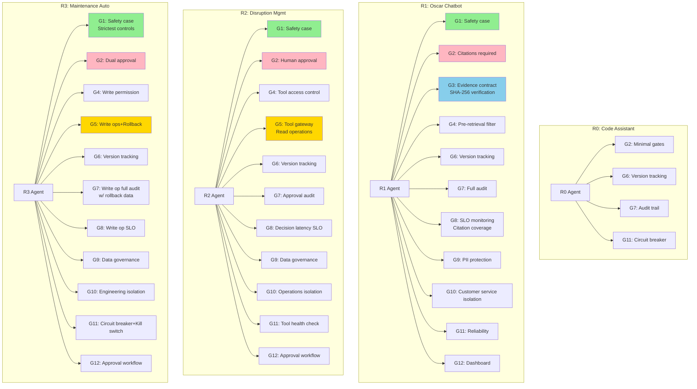

```mermaid
graph TB
    subgraph "R0: Code Assistant"
        R0[R0 Agent] --> G2_R0[G2: Minimal gates]
        R0 --> G6_R0[G6: Version tracking]
        R0 --> G7_R0[G7: Audit trail]
        R0 --> G11_R0[G11: Circuit breaker]
    end

    subgraph "R1: Oscar Chatbot"
        R1[R1 Agent] --> G1_R1[G1: Safety case]
        R1 --> G2_R1[G2: Citations required]
        R1 --> G3_R1[G3: Evidence contract<br/>SHA-256 verification]
        R1 --> G4_R1[G4: Pre-retrieval filter]
        R1 --> G6_R1[G6: Version tracking]
        R1 --> G7_R1[G7: Full audit]
        R1 --> G8_R1[G8: SLO monitoring<br/>Citation coverage]
        R1 --> G9_R1[G9: PII protection]
        R1 --> G10_R1[G10: Customer service isolation]
        R1 --> G11_R1[G11: Reliability]
        R1 --> G12_R1[G12: Dashboard]
    end

    subgraph "R2: Disruption Mgmt"
        R2[R2 Agent] --> G1_R2[G1: Safety case]
        R2 --> G2_R2[G2: Human approval]
        R2 --> G4_R2[G4: Tool access control]
        R2 --> G5_R2[G5: Tool gateway<br/>Read operations]
        R2 --> G6_R2[G6: Version tracking]
        R2 --> G7_R2[G7: Approval audit]
        R2 --> G8_R2[G8: Decision latency SLO]
        R2 --> G9_R2[G9: Data governance]
        R2 --> G10_R2[G10: Operations isolation]
        R2 --> G11_R2[G11: Tool health check]
        R2 --> G12_R2[G12: Approval workflow]
    end

    subgraph "R3: Maintenance Auto"
        R3[R3 Agent] --> G1_R3[G1: Safety case<br/>Strictest controls]
        R3 --> G2_R3[G2: Dual approval]
        R3 --> G4_R3[G4: Write permission]
        R3 --> G5_R3[G5: Write ops+Rollback]
        R3 --> G6_R3[G6: Version tracking]
        R3 --> G7_R3[G7: Write op full audit<br/>w/ rollback data]
        R3 --> G8_R3[G8: Write op SLO]
        R3 --> G9_R3[G9: Data governance]
        R3 --> G10_R3[G10: Engineering isolation]
        R3 --> G11_R3[G11: Circuit breaker+Kill switch]
        R3 --> G12_R3[G12: Approval workflow]
    end

    style G1_R1 fill:#90EE90
    style G1_R2 fill:#90EE90
    style G1_R3 fill:#90EE90
    style G2_R1 fill:#FFB6C1
    style G2_R2 fill:#FFB6C1
    style G2_R3 fill:#FFB6C1
    style G3_R1 fill:#87CEEB
    style G5_R2 fill:#FFD700
    style G5_R3 fill:#FFD700
```