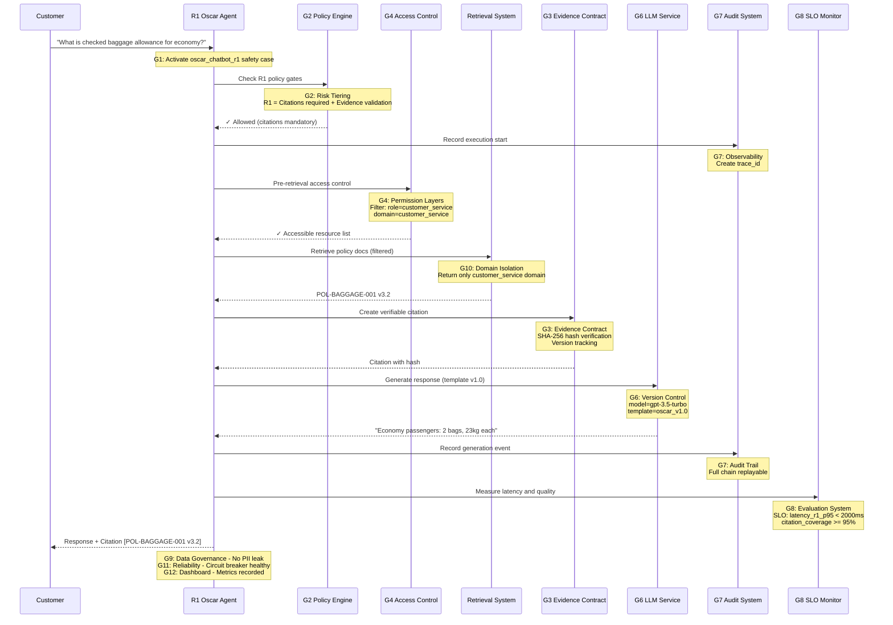

```mermaid
sequenceDiagram
    participant Customer
    participant Oscar as R1 Oscar Agent
    participant Policy as G2 Policy Engine
    participant Access as G4 Access Control
    participant Retrieval as Retrieval System
    participant Evidence as G3 Evidence Contract
    participant LLM as G6 LLM Service
    participant Audit as G7 Audit System
    participant SLO as G8 SLO Monitor

    Customer->>Oscar: "What is checked baggage allowance for economy?"

    Note over Oscar: G1: Activate oscar_chatbot_r1 safety case
    Oscar->>Policy: Check R1 policy gates
    Note over Policy: G2: Risk Tiering<br/>R1 = Citations required + Evidence validation
    Policy-->>Oscar: ✓ Allowed (citations mandatory)

    Oscar->>Audit: Record execution start
    Note over Audit: G7: Observability<br/>Create trace_id

    Oscar->>Access: Pre-retrieval access control
    Note over Access: G4: Permission Layers<br/>Filter: role=customer_service<br/>domain=customer_service
    Access-->>Oscar: ✓ Accessible resource list

    Oscar->>Retrieval: Retrieve policy docs (filtered)
    Note over Retrieval: G10: Domain Isolation<br/>Return only customer_service domain
    Retrieval-->>Oscar: POL-BAGGAGE-001 v3.2

    Oscar->>Evidence: Create verifiable citation
    Note over Evidence: G3: Evidence Contract<br/>SHA-256 hash verification<br/>Version tracking
    Evidence-->>Oscar: Citation with hash

    Oscar->>LLM: Generate response (template v1.0)
    Note over LLM: G6: Version Control<br/>model=gpt-3.5-turbo<br/>template=oscar_v1.0
    LLM-->>Oscar: "Economy passengers: 2 bags, 23kg each"

    Oscar->>Audit: Record generation event
    Note over Audit: G7: Audit Trail<br/>Full chain replayable

    Oscar->>SLO: Measure latency and quality
    Note over SLO: G8: Evaluation System<br/>SLO: latency_r1_p95 < 2000ms<br/>citation_coverage >= 95%

    Oscar-->>Customer: Response + Citation [POL-BAGGAGE-001 v3.2]

    Note over Oscar: G9: Data Governance - No PII leak<br/>G11: Reliability - Circuit breaker healthy<br/>G12: Dashboard - Metrics recorded
```