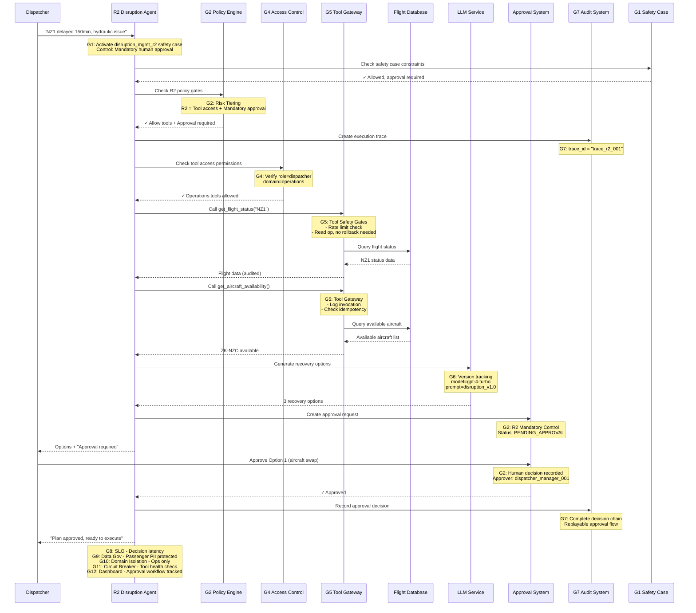

```mermaid
sequenceDiagram
    participant Dispatcher
    participant R2Agent as R2 Disruption Agent
    participant Policy as G2 Policy Engine
    participant Access as G4 Access Control
    participant ToolGW as G5 Tool Gateway
    participant FlightDB as Flight Database
    participant LLM as LLM Service
    participant Approval as Approval System
    participant Audit as G7 Audit System
    participant Safety as G1 Safety Case

    Dispatcher->>R2Agent: "NZ1 delayed 150min, hydraulic issue"

    Note over R2Agent: G1: Activate disruption_mgmt_r2 safety case<br/>Control: Mandatory human approval
    R2Agent->>Safety: Check safety case constraints
    Safety-->>R2Agent: ✓ Allowed, approval required

    R2Agent->>Policy: Check R2 policy gates
    Note over Policy: G2: Risk Tiering<br/>R2 = Tool access + Mandatory approval
    Policy-->>R2Agent: ✓ Allow tools + Approval required

    R2Agent->>Audit: Create execution trace
    Note over Audit: G7: trace_id = "trace_r2_001"

    R2Agent->>Access: Check tool access permissions
    Note over Access: G4: Verify role=dispatcher<br/>domain=operations
    Access-->>R2Agent: ✓ Operations tools allowed

    R2Agent->>ToolGW: Call get_flight_status("NZ1")
    Note over ToolGW: G5: Tool Safety Gates<br/>- Rate limit check<br/>- Read op, no rollback needed
    ToolGW->>FlightDB: Query flight status
    FlightDB-->>ToolGW: NZ1 status data
    ToolGW-->>R2Agent: Flight data (audited)

    R2Agent->>ToolGW: Call get_aircraft_availability()
    Note over ToolGW: G5: Tool Gateway<br/>- Log invocation<br/>- Check idempotency
    ToolGW->>FlightDB: Query available aircraft
    FlightDB-->>ToolGW: Available aircraft list
    ToolGW-->>R2Agent: ZK-NZC available

    R2Agent->>LLM: Generate recovery options
    Note over LLM: G6: Version tracking<br/>model=gpt-4-turbo<br/>prompt=disruption_v1.0
    LLM-->>R2Agent: 3 recovery options

    R2Agent->>Approval: Create approval request
    Note over Approval: G2: R2 Mandatory Control<br/>Status: PENDING_APPROVAL
    R2Agent-->>Dispatcher: Options + "Approval required"

    Dispatcher->>Approval: Approve Option 1 (aircraft swap)
    Note over Approval: G2: Human decision recorded<br/>Approver: dispatcher_manager_001
    Approval-->>R2Agent: ✓ Approved

    R2Agent->>Audit: Record approval decision
    Note over Audit: G7: Complete decision chain<br/>Replayable approval flow

    R2Agent-->>Dispatcher: "Plan approved, ready to execute"

    Note over R2Agent: G8: SLO - Decision latency<br/>G9: Data Gov - Passenger PII protected<br/>G10: Domain Isolation - Ops only<br/>G11: Circuit Breaker - Tool health check<br/>G12: Dashboard - Approval workflow tracked
```
