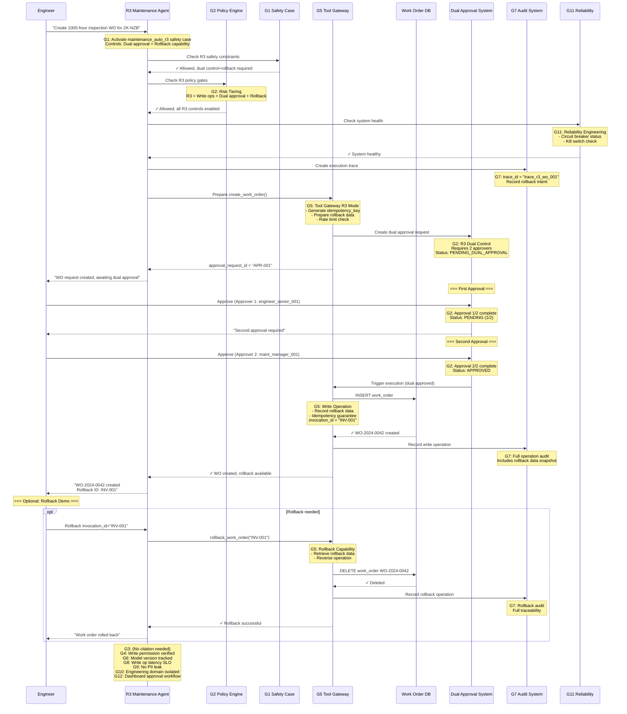

```mermaid
sequenceDiagram
    participant Engineer
    participant R3Agent as R3 Maintenance Agent
    participant Policy as G2 Policy Engine
    participant Safety as G1 Safety Case
    participant ToolGW as G5 Tool Gateway
    participant WorkOrderDB as Work Order DB
    participant Approval as Dual Approval System
    participant Audit as G7 Audit System
    participant Reliability as G11 Reliability

    Engineer->>R3Agent: "Create 1000-hour inspection WO for ZK-NZB"

    Note over R3Agent: G1: Activate maintenance_auto_r3 safety case<br/>Controls: Dual approval + Rollback capability
    R3Agent->>Safety: Check R3 safety constraints
    Safety-->>R3Agent: ✓ Allowed, dual control+rollback required

    R3Agent->>Policy: Check R3 policy gates
    Note over Policy: G2: Risk Tiering<br/>R3 = Write ops + Dual approval + Rollback
    Policy-->>R3Agent: ✓ Allowed, all R3 controls enabled

    R3Agent->>Reliability: Check system health
    Note over Reliability: G11: Reliability Engineering<br/>- Circuit breaker status<br/>- Kill switch check
    Reliability-->>R3Agent: ✓ System healthy

    R3Agent->>Audit: Create execution trace
    Note over Audit: G7: trace_id = "trace_r3_wo_001"<br/>Record rollback intent

    R3Agent->>ToolGW: Prepare create_work_order()
    Note over ToolGW: G5: Tool Gateway R3 Mode<br/>- Generate idempotency_key<br/>- Prepare rollback data<br/>- Rate limit check

    ToolGW->>Approval: Create dual approval request
    Note over Approval: G2: R3 Dual Control<br/>Requires 2 approvers<br/>Status: PENDING_DUAL_APPROVAL
    ToolGW-->>R3Agent: approval_request_id = "APR-001"

    R3Agent-->>Engineer: "WO request created, awaiting dual approval"

    Note over Approval: === First Approval ===
    Engineer->>Approval: Approve (Approver 1: engineer_senior_001)
    Note over Approval: G2: Approval 1/2 complete<br/>Status: PENDING (1/2)
    Approval-->>Engineer: "Second approval required"

    Note over Approval: === Second Approval ===
    Engineer->>Approval: Approve (Approver 2: maint_manager_001)
    Note over Approval: G2: Approval 2/2 complete<br/>Status: APPROVED

    Approval->>ToolGW: Trigger execution (dual approved)

    ToolGW->>WorkOrderDB: INSERT work_order
    Note over ToolGW: G5: Write Operation<br/>- Record rollback data<br/>- Idempotency guarantee<br/>invocation_id = "INV-001"
    WorkOrderDB-->>ToolGW: ✓ WO-2024-0042 created

    ToolGW->>Audit: Record write operation
    Note over Audit: G7: Full operation audit<br/>Includes rollback data snapshot

    ToolGW-->>R3Agent: ✓ WO created, rollback available
    R3Agent-->>Engineer: "WO-2024-0042 created<br/>Rollback ID: INV-001"

    Note over Engineer: === Optional: Rollback Demo ===
    opt Rollback needed
        Engineer->>R3Agent: Rollback invocation_id="INV-001"
        R3Agent->>ToolGW: rollback_work_order("INV-001")
        Note over ToolGW: G5: Rollback Capability<br/>- Retrieve rollback data<br/>- Reverse operation
        ToolGW->>WorkOrderDB: DELETE work_order WO-2024-0042
        WorkOrderDB-->>ToolGW: ✓ Deleted
        ToolGW->>Audit: Record rollback operation
        Note over Audit: G7: Rollback audit<br/>Full traceability
        ToolGW-->>R3Agent: ✓ Rollback successful
        R3Agent-->>Engineer: "Work order rolled back"
    end

    Note over R3Agent: G3: (No citation needed)<br/>G4: Write permission verified<br/>G6: Model version tracked<br/>G8: Write op latency SLO<br/>G9: No PII leak<br/>G10: Engineering domain isolated<br/>G12: Dashboard approval workflow
```